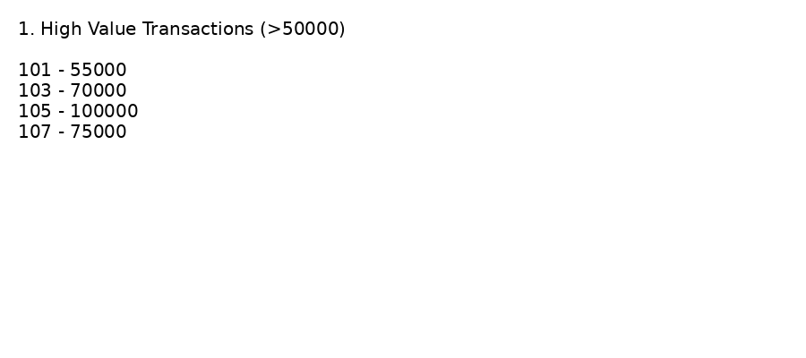

# 💳 Banking Fraud Detection using SQL

## 📌 Objective
Analyze banking transactions to identify fraudulent or suspicious activities using SQL queries.

---

## 🛠️ Tools Used
- SQL (MySQL)

---

## 📊 Dataset
The dataset contains transaction-level data including:
- Customer ID
- Transaction Amount
- Transaction Date
- Transaction Type
- Location

---

## 🔍 Key Analysis Performed

### 1. High Value Transactions
- Identified transactions greater than ₹50,000

### 2. Multiple Transactions in Same Day
- Detected customers performing multiple transactions in a single day

### 3. Previous Transaction Analysis (LAG)
- Used window function to track previous transactions

### 4. Rapid Transactions Detection
- Flagged transactions occurring within short time intervals (<5 minutes)

### 5. Fraud Score Calculation
- Assigned fraud scores based on suspicious behavior

---

## 📸 Screenshots

---

## 📁 Project Structure
